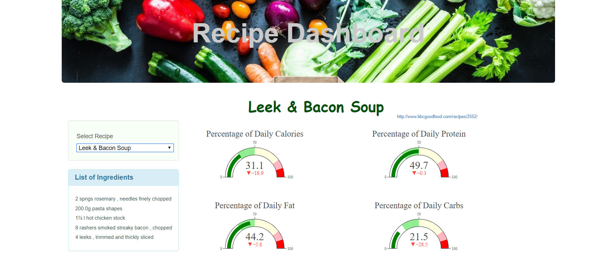
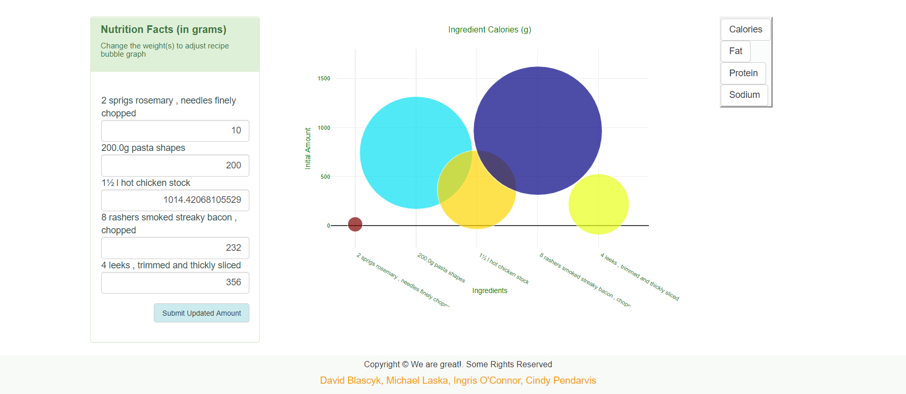

**# Recipe_Nurtrion_Dashboard**

Group Project by: David Blascyk, Michael Laska, Ingris O'Connor, and Cindy Pendarvis

An interactive nutrition analysis dashboard available to the public at <a href="https://blasda01.github.io/Recipe_Nutrition_App/" target="_blank">https://blasda01.github.io/Recipe_Nutrition_App/</a>.

Have you ever wanted to make a recipe, but weren’t sure just how good that recipe really is for your health? 
Or you really wish you could figure out if that favorite recipe could be healthy with just a few slight alterations. 
Our project focused on utilizing recipe data to help the user visualize and understand how each ingredient contributes to their daily nutrition goals as well as help users to explore ways in which they can modify a recipe to meet their specific needs. 

**Process**

*Create a database of food recipes and another database of food ingredient nutrition through API calls to <a href="https://www.edamam.com/" target="_blank">Edamam API</a>.

*Design interactive dashboard for users to explore specific recipes using HTML and Javascript.

*Create buttons to display new graph details (ie changing view from Calories to Protein)

*Create functions to change nutrition information graphics once user inputs alterred ingredient amounts.

**Tools Used**
Python, Jupyter Notebook, HTML, JavaScript, JQuery, D3, Bootstrap CSS

**Dashboard Snapshot**

 